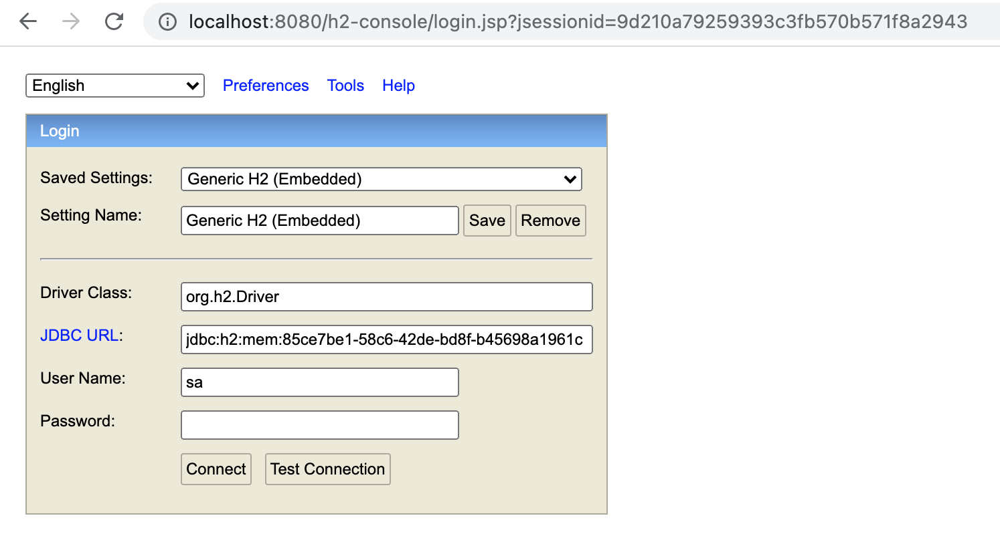
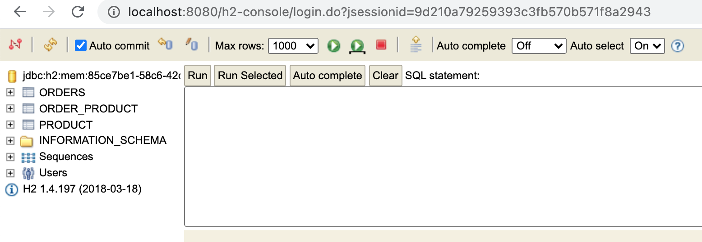
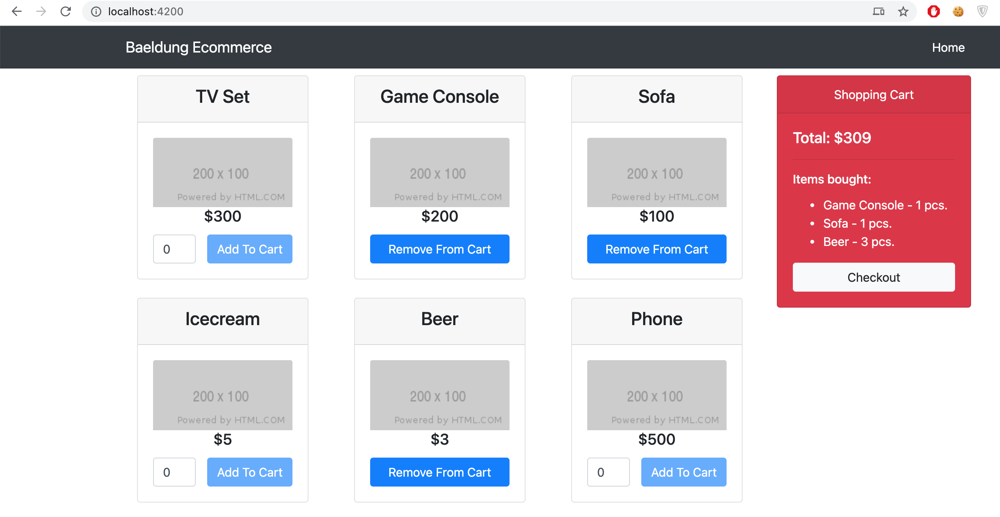

## itelligence Hackathon December 2020

---
## IMPORTANT NOTICE
In the hackathon you will be asked to add features to this inital sample project. It is good to make practices on how to add new features to the project. 

This project is based on the example provided by baeldung website only with some differences on pom.xml.

---

This example project is ready to install and run. You should be able to run the project without performing steps in the tutorial. Some notes to keep in mind:

- You can use any IDE you're comfortable with. An IDE which has SpringBoot support (e.g. Eclipse with a Spring plugin, IntelliJ Ultimate) may be helpful but not mandatory since the project can run like a Java application.
- Start the Angular application with `npm start` instead `ng serve`.
- For database, application logs something similar to the following during startup

```
[main] INFO  com.zaxxer.hikari.HikariDataSource - ecommercedb - Starting...
[main] INFO  com.zaxxer.hikari.HikariDataSource - ecommercedb - Start completed.
[main] INFO  o.s.b.a.h.H2ConsoleAutoConfiguration - H2 console available at '/h2-console'. Database available at 'jdbc:h2:mem:85ce7be1-58c6-42de-bd8f-b45698a1961c'
```
You should be able to connect to the DB from http://localhost:8080/h2-console/ with the destination specified at the log starts with `jdbc:h2:mem`




- After installing the project, you should be able to see the frontend at http://localhost:4200/ with all functions (e.g, adding to cart, removing from cart etc.) successfully.



# Original README.md

>## Spring Boot Angular
>
>This module contains articles about Spring Boot with Angular
>
>### Relevant Articles:
>
>- [Building a Web Application with Spring Boot and Angular](https://www.baeldung.com/spring-boot-angular-web)
>- [A Simple E-Commerce Implementation with Spring](https://www.baeldung.com/spring-angular-ecommerce)
